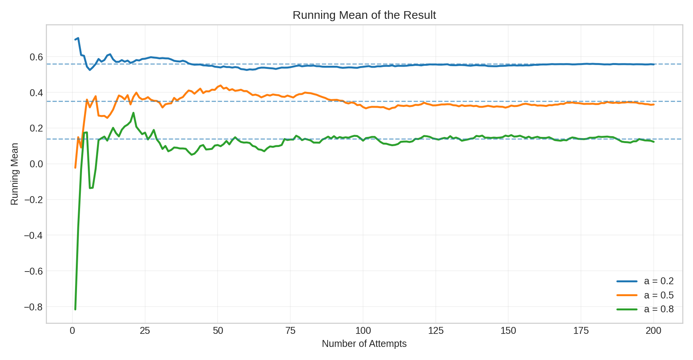
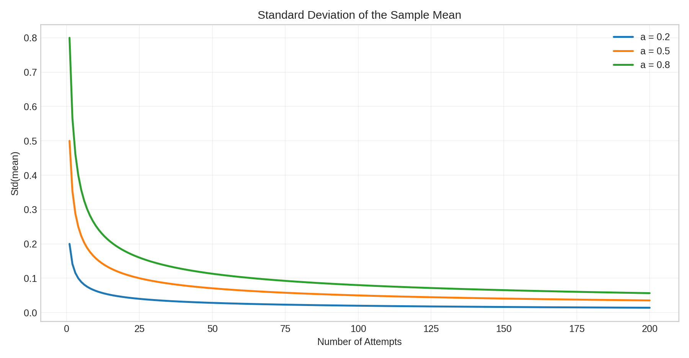

---
author:
  name: Ведьмина Александра Сергеевна
  degrees: student
  email: 1132236003@rudn.ru
  affiliation:
    - name: Российский университет дружбы народов
      country: Российская Федерация
      postal-code: 117198
      city: Москва
      address: ул. Миклухо-Маклая, д. 6
title: "Математическое моделирование"
subtitle: "Доклад. Модель «Умение и удача»"
license: "CC BY"
---

# Цель работы

Показать, как математическая модель разделяет наблюдаемый результат на
устойчивую составляющую умения и случайную составляющую удачи, и почему при
высоком уровне шума единичное наблюдение плохо отражает реальный уровень
объекта.

# Задание

В рамках доклада требовалось:

1. формализовать модель `Skill/Luck`;
2. вывести среднее значение и дисперсию результата;
3. выполнить компьютерную симуляцию для нескольких уровней случайности;
4. показать влияние длины серии наблюдений на надежность оценки;
5. оформить материал в виде стандартного отчета и презентации Quarto.

# Теоретическое введение

## Разделение результата на умение и удачу

Во многих прикладных задачах итоговый результат определяется не только
качеством подготовки, но и случайными обстоятельствами. Это относится к
спорту, финансовым стратегиям, экзаменам, бизнес-метрикам и машинному
обучению. Для описания такой ситуации удобно рассматривать наблюдаемый
результат `X` как смесь двух компонент:

- `Skill` --- устойчивая часть, которая воспроизводится от попытки к попытке;
- `Luck` --- случайная часть, отражающая шум, внешние условия и отклонения.

Такая постановка соответствует распространенному в прикладной литературе
подходу к разделению наблюдаемого результата на устойчивую и случайную
составляющие [@mauboussin2012].

Простейшая форма модели записывается так:

$$
X = a \cdot Luck + (1-a) \cdot Skill, \qquad 0 < a < 1.
$$

Параметр `a` определяет долю случайности:

- при малом `a` результат почти полностью объясняется умением;
- при большом `a` наблюдения становятся шумными и труднее интерпретируются.

## Математические свойства модели

Пусть случайная величина `Luck` имеет нулевое среднее и дисперсию
`Var(Luck) = \sigma_L^2`. Тогда:

$$
\mathbb{E}[X] = (1-a) \cdot Skill,
\qquad
\mathrm{Var}(X) = a^2 \sigma_L^2.
$$

Если в симуляции положить `Luck ~ N(0,1)`, формулы упрощаются до:

$$
\mathbb{E}[X] = (1-a) \cdot Skill,
\qquad
\mathrm{Var}(X) = a^2.
$$

Таким образом:

- среднее значение определяется стабильной частью;
- разброс растет квадратично по `a`;
- при высокой случайности отдельные наблюдения малоинформативны.

## Среднее по серии наблюдений

Если рассматривать не один результат, а среднее по `n` независимым попыткам,
то дисперсия оценки уменьшается:

$$
\mathrm{Var}(\overline{X}_n) = \frac{a^2 \sigma_L^2}{n},
\qquad
\mathrm{Std}(\overline{X}_n) = \frac{a \sigma_L}{\sqrt{n}}.
$$

Это и есть практический смысл закона больших чисел: чем длиннее серия
наблюдений, тем слабее влияние случайности на итоговую оценку
[@ross2019; @wasserman2004].

# Выполнение работы

## Исходный материал и воспроизводимая организация

В каталоге `labs/doclad-mat` исходный текст был предоставлен в исходном
`docx`-файле. Для перевода материала в обычный для репозитория формат были
подготовлены:

- каталог `report/` с Quarto-отчетом;
- каталог `presentation/` с Quarto-презентацией;
- каталог `scripts/` со сценарием генерации графиков;
- каталоги `data/` и `plots/` с результатами симуляции.

Основной вычислительный сценарий сохранен в Python-скрипте генерации
графиков. Он:

1. генерирует серии наблюдений для нескольких значений `a`;
2. вычисляет накопленные средние;
3. строит распределения результатов;
4. оценивает надежность среднего по мере роста длины серии;
5. сравнивает двух участников по одной попытке и по среднему из `50` попыток.

### Ключевой фрагмент вычислительного сценария

```python
result = (
    alpha * rng.normal(size=n_attempts)
    + (1.0 - alpha) * skill
)
running_mean = np.cumsum(result) / np.arange(
    1, n_attempts + 1
)
stderr = alpha / np.sqrt(
    np.arange(1, n_attempts + 1)
)
```

Здесь последовательно реализуются три ключевые идеи модели: генерация
наблюдаемого результата, накопленное среднее и убывание стандартной ошибки
оценки по закону `1 / \sqrt{n}`.

## Параметры симуляции

Для численного эксперимента были выбраны параметры из исходного текста
доклада.

| Параметр | Значение | Смысл |
|---|---:|---|
| `Skill` | `0.70` | условный устойчивый уровень |
| `Luck` | `N(0,1)` | случайные отклонения |
| `a` | `0.2`, `0.5`, `0.8` | малая, средняя и высокая доля удачи |
| `n` | `200` | длина одной серии наблюдений |
| `Skill_A`, `Skill_B` | `0.82`, `0.58` | параметры сравнения двух участников |
| `a_compare` | `0.6` | доля случайности в задаче сравнения |

: Параметры симуляции {#tbl-params}

## Отдельные результаты при разных уровнях случайности

{#fig-a02 width=92%}

При `a = 0.2` случайная составляющая невелика. Значения колеблются около
теоретического среднего `0.56`, поэтому уже короткая серия дает адекватное
представление об устойчивом уровне.

{#fig-a05 width=92%}

При `a = 0.5` разброс заметно увеличивается. Отдельные попытки уже могут
существенно отклоняться от средней линии, и по одной реализации трудно судить
о реальном качестве объекта.

{#fig-a08 width=92%}

При `a = 0.8` случайность доминирует. Траектория выглядит хаотичной, а
единичное наблюдение почти не несет достоверной информации об умении.

## Сходимость накопленного среднего

{#fig-running-mean width=92%}

На этом графике видно, что при увеличении числа наблюдений все траектории
постепенно стабилизируются. Однако скорость стабилизации зависит от `a`:

- при `a = 0.2` среднее быстро выходит к стационарному уровню;
- при `a = 0.5` колебания затухают заметно медленнее;
- при `a = 0.8` даже после десятков попыток остается значимый шум.

В выполненной симуляции после `200` попыток накопленные средние составили
`0.556`, `0.332` и `0.123` соответственно. Эти значения близки к теоретическим
уровням `0.56`, `0.35` и `0.14`, но отклонение при большом `a` заметно сильнее.

Именно поэтому короткие рейтинги и разовые победы часто вводят в заблуждение.

## Распределение результатов

{#fig-distribution width=92%}

Распределения наглядно показывают рост разброса при увеличении случайной доли.
Узкое распределение соответствует режиму, где преобладает умение, а широкое
распределение означает высокую вероятность как очень удачных, так и очень
неудачных исходов.

## Надежность оценки при увеличении числа попыток

{#fig-reliability width=92%}

График подтверждает формулу
`\mathrm{Std}(\overline{X}_n) = a / \sqrt{n}` для случая `Var(Luck) = 1`.
Во всех режимах точность растет с числом наблюдений, однако в шумной среде
для той же надежности требуется существенно более длинная серия.

## Сравнение двух участников

{#fig-comparison width=92%}

В эксперименте участник `A` имеет более высокий уровень умения, чем участник
`B`, но сравнение по одной попытке остается ненадежным из-за большой доли
случайности. Когда же сравнивается среднее по `50` попыткам, распределение
разности сужается, и истинное преимущество сильнейшего участника проявляется
значительно яснее. В данном прогоне вероятность того, что участник `A`
окажется лучше участника `B`, выросла с `54.3%` для одной попытки до `79.0%`
для среднего по `50` попыткам. При этом стандартное отклонение разности
уменьшилось с `0.849` до `0.120`.

## Сводка по модели

С теоретической точки зрения ожидаемые значения для выбранных параметров равны:

| `a` | `E[X] = (1-a) * Skill` | `Var(X) = a^2` |
|---:|---:|---:|
| `0.2` | `0.56` | `0.04` |
| `0.5` | `0.35` | `0.25` |
| `0.8` | `0.14` | `0.64` |

: Теоретические характеристики модели {#tbl-theory}

Эмпирическая симуляция согласуется с этими оценками:

| `a` | Эмпирическое среднее | Эмпирическая дисперсия | Итоговое накопленное среднее |
|---:|---:|---:|---:|
| `0.2` | `0.556` | `0.035` | `0.556` |
| `0.5` | `0.332` | `0.267` | `0.332` |
| `0.8` | `0.123` | `0.686` | `0.123` |

: Эмпирические характеристики симуляции {#tbl-empirical}

Рост `a` не меняет саму логику усреднения, но резко увеличивает шум каждой
отдельной реализации. Это делает главной практической задачей не наблюдение
единичного исхода, а сбор достаточно длинной серии.

# Практические интерпретации

## Спорт

В спортивных соревнованиях на исход одной игры влияют судейские решения,
локальные ошибки, травмы, покрытие, погода и множество единичных событий.
Поэтому результат отдельного матча может противоречить реальной силе команд,
а длинный турнир обычно отражает ее точнее. Схожие эмпирические попытки
разделить вклад мастерства и случайности рассматриваются, например, в
работах о покере и сравнении игр с разной долей шанса [@levitt2014;
@duersch2020].

## Финансы и инвестиции

Высокая доходность за один месяц или квартал может возникнуть как следствие
рыночного шума, а не качества стратегии. Для отделения мастерства от удачи
нужны длинные временные ряды, сравнение с бенчмарком и учет риска.

## Образование и экзамены

Один тест не всегда точно измеряет знания: на результат влияют знакомство с
конкретными вопросами, волнение и элемент угадывания. Поэтому более надежная
оценка строится по серии независимых заданий и нескольким формам контроля.

## Машинное обучение

В машинном обучении случайность появляется из-за случайной инициализации,
разбиения на обучающую и тестовую выборки и шума в данных. Именно поэтому
качество модели следует оценивать по нескольким запускам, а не по одному
удачному измерению метрики.

# Выводы

В ходе работы исходный текст доклада был преобразован в стандартный для
репозитория формат отчета и дополнен воспроизводимой симуляцией. Анализ модели
показал:

1. наблюдаемый результат естественно представлять как смесь умения и удачи;
2. рост параметра `a` квадратично увеличивает разброс результатов;
3. единичное наблюдение ненадежно в системах с высокой случайностью;
4. среднее по длинной серии гораздо лучше отражает устойчивый уровень;
5. модель полезна для интерпретации результатов в спорте, финансах,
   образовании и машинном обучении.

# Список источников

::: {#refs}
:::
