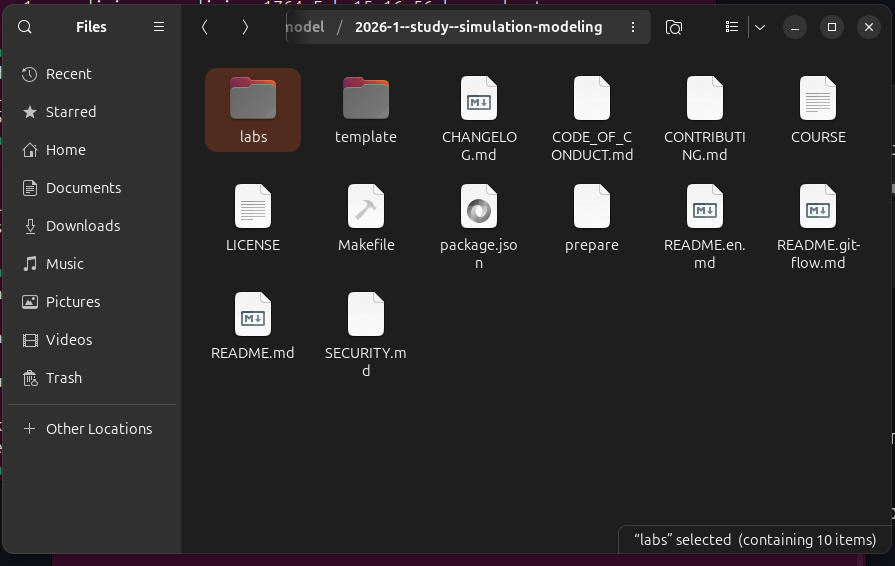
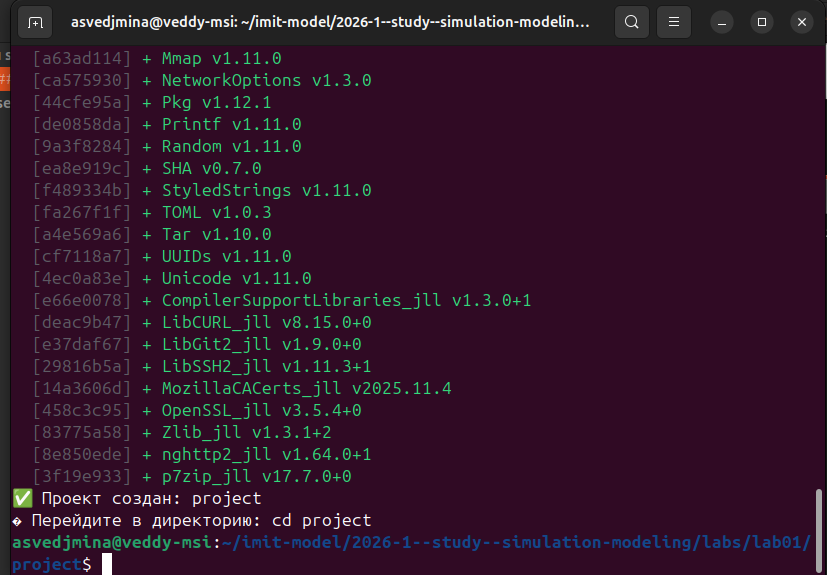
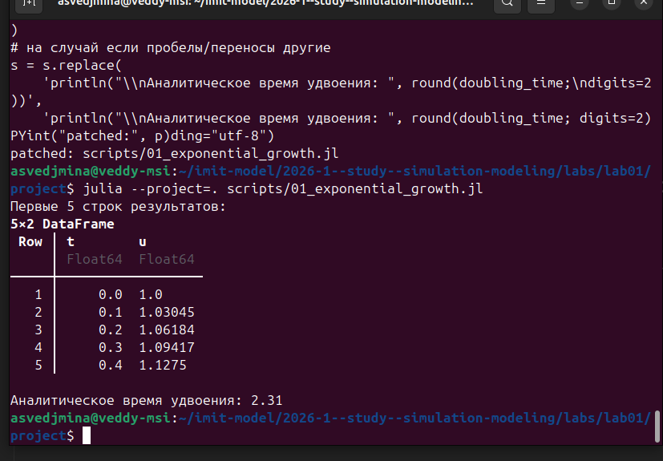
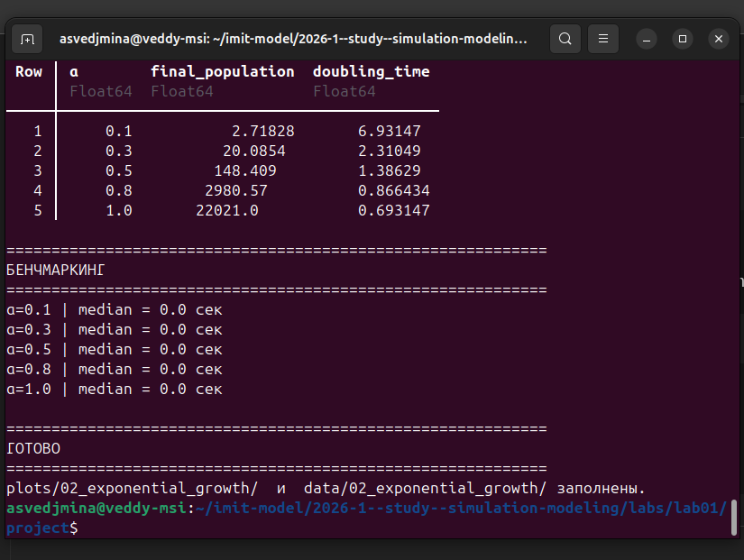
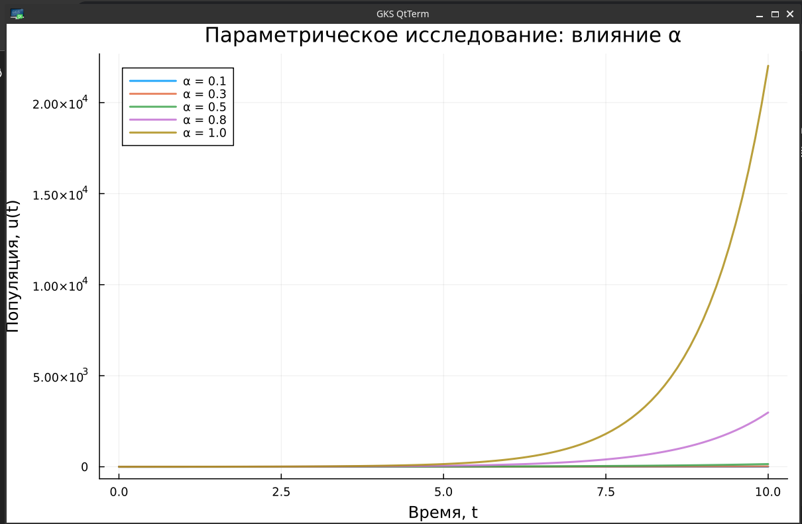

---
## Author
author:
  name: Ведьмина Александра Сергеевна
  degrees: student
  email: 1132236003@rudn.ru
  affiliation:
    - name: Российский университет дружбы народов
      country: Российская Федерация
      postal-code: 117198
      city: Москва
      address: ул. Миклухо-Маклая, д. 6
## Title
title: Лабораторная работа №1
subtitle: Математическое моделирование
license: CC BY
date: today
date-format: "YYYY-MM-DD"
---

# Информация

## Докладчик

:::::::::::::: {.columns align=center}
::: {.column width="70%"}

  * Ведьмина Александра Сергеевна
  * студент
  * Российский университет дружбы народов
  * [1132236003@rudn.ru](mailto:1132236003@rudn.ru)

:::
::: {.column width="30%"}

:::
::::::::::::::

# Вводная часть

## Цель работы

Исследовать решение ОДУ экспоненциального роста с использованием Julia и инструментов воспроизводимых исследований (DrWatson, Literate, Quarto).

## Задачи

- Настройка рабочего пространства (git, git-flow)
- Установка Julia и создание проекта DrWatson
- Выполнение базовой модели экспоненциального роста
- Создание производных форматов из литературного кода
- Параметрическое исследование экспоненциального роста

# Выполнение лабораторной работы

## Структура рабочего каталога

## Установка git-flow

## Установка Julia 1.12.4

## Создание проекта DrWatson

## Установка пакетов

## Базовая модель экспоненциального роста

## Результаты вычисления

## Генерация производных форматов

## Параметрическое сканирование

## Результаты параметрического сканирования

## Влияние $\alpha$ на динамику роста

# Результаты

## Выводы

- Настроена рабочая среда: git-flow, Julia 1.12.4, проект DrWatson
- Реализована модель экспоненциального роста (DifferentialEquations.jl)
- Проведён базовый эксперимент ($\alpha = 0.3$, $T_2 = 2.31$)
- Создан литературный код с генерацией производных форматов
- Выполнено параметрическое сканирование по $\alpha \in \{0.1, 0.3, 0.5, 0.8, 1.0\}$
