---
## Author
author:
  name: Ведьмина Александра Сергеевна
  degrees: student
  email: 1132236003@rudn.ru
  affiliation:
    - name: Российский университет дружбы народов
      country: Российская Федерация
      postal-code: 117198
      city: Москва
      address: ул. Миклухо-Маклая, д. 6

## Title
title: "Математическое моделирование"
subtitle: "Лабораторная работа №1"
license: "CC BY"
---

# Цель работы

Исследовать решение обыкновенного дифференциального уравнения экспоненциального роста с использованием языка программирования Julia и инструментов воспроизводимых исследований (DrWatson, Literate, Quarto), а также освоить методы параметрического анализа, визуализации и документирования результатов вычислительного эксперимента.

# Задание

1. Настройка рабочего пространства (git, git-flow).
2. Установка Julia и создание проекта DrWatson для лабораторных работ.
3. Выполнение базовой модели экспоненциального роста.
4. Преобразование кода в литературный стиль и создание производных форматов.
5. Параметрическое исследование экспоненциального роста.

# Теоретическое введение

Модель экспоненциального роста описывает процесс изменения величины, скорость которого пропорциональна текущему значению. Математически это записывается в виде обыкновенного дифференциального уравнения:

$$
\frac{du}{dt} = \alpha u, \quad u(0) = u_0,
$$

где $u(t)$ --- исследуемая величина (например, численность популяции), $\alpha$ --- скорость роста, $u_0$ --- начальное значение.

Аналитическое решение имеет вид $u(t) = u_0 e^{\alpha t}$. Ключевой характеристикой процесса является время удвоения $T_2 = \ln 2 / \alpha$ --- период, за который величина увеличивается вдвое.

Численное решение с использованием пакета DifferentialEquations.jl позволяет исследовать поведение системы при различных параметрах, проводить параметрический анализ и верифицировать численные методы.

# Выполнение лабораторной работы

## 1. Настройка рабочего пространства

Проверим подключение к GitHub по SSH.

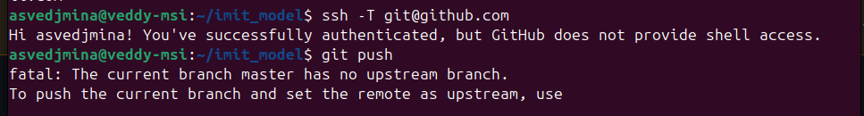{#fig-001 width=70%}

Проверим структуру рабочего каталога курса.

{#fig-002 width=70%}

Установим git-flow и проведём инициализацию.

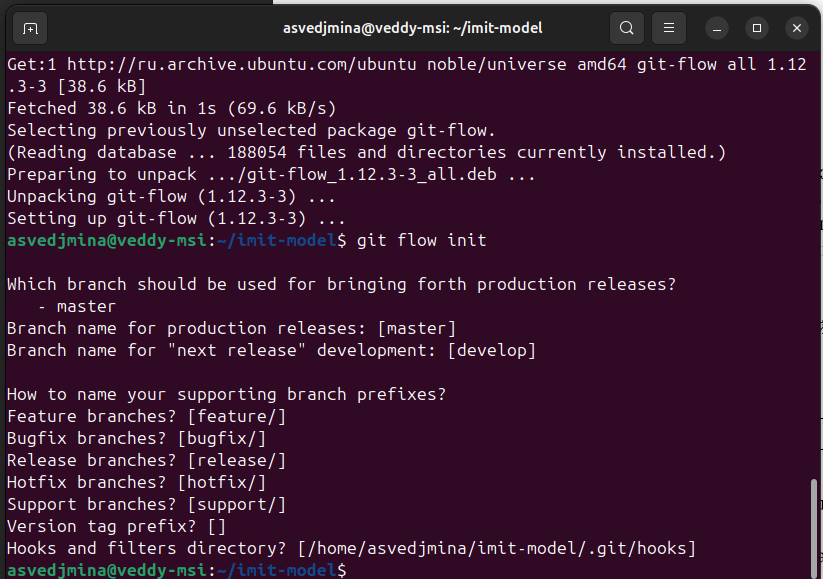{#fig-003 width=70%}

Проверим работу git-flow: создадим и завершим feature-ветку.

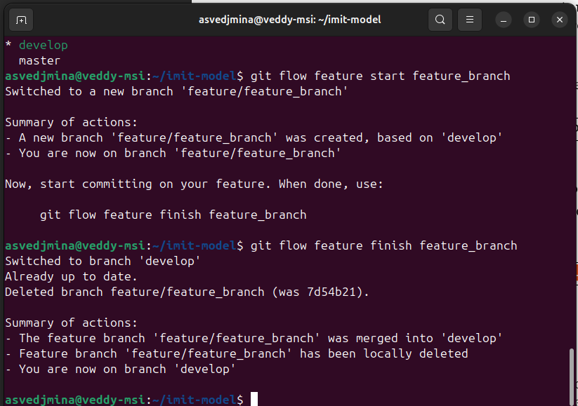{#fig-004 width=70%}

## 2. Установка Julia и создание проекта DrWatson

Установим Julia через snap.

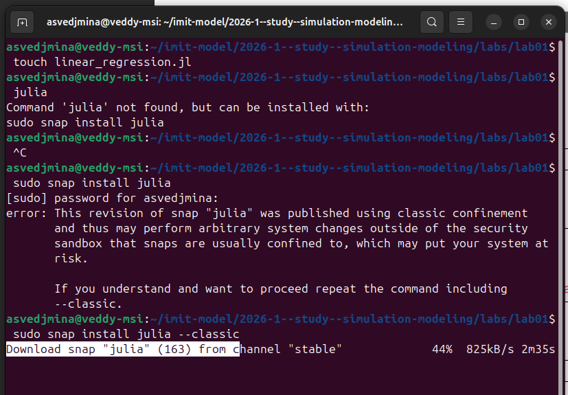{#fig-005 width=70%}

Julia 1.12.4 успешно установлена.

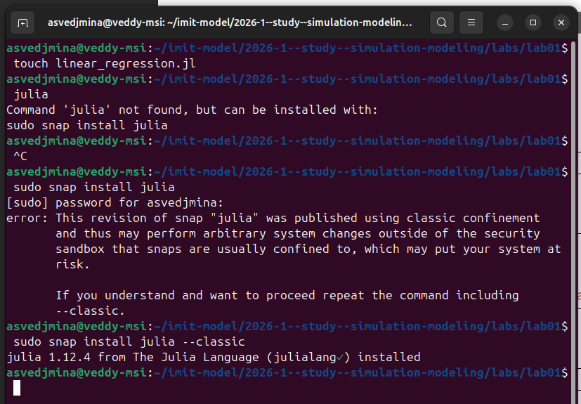{#fig-006 width=70%}

Создадим проект DrWatson для лабораторных работ с помощью скрипта setup_project.jl.

{#fig-007 width=70%}

Запустим установку необходимых пакетов (DifferentialEquations, Plots, DataFrames, DrWatson и др.) с помощью скрипта add_packages.jl.

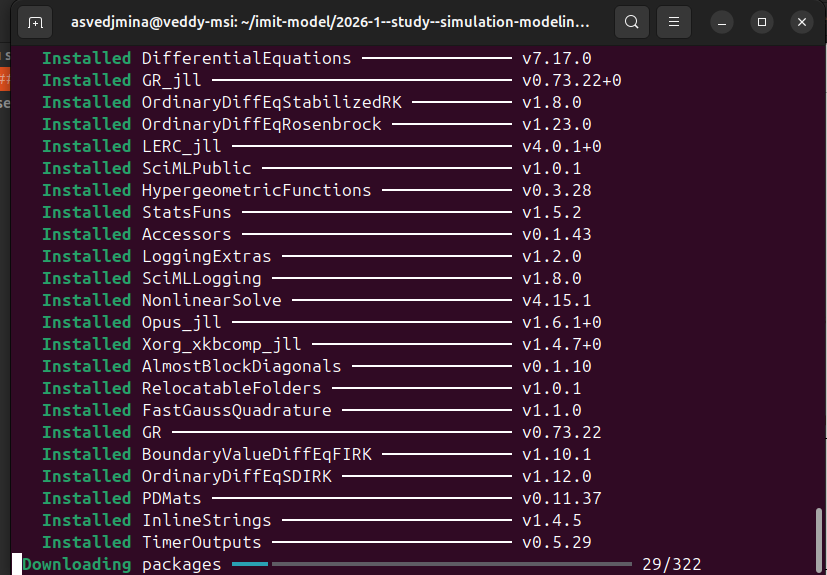{#fig-008 width=70%}

Все пакеты успешно установлены и прекомпилированы.

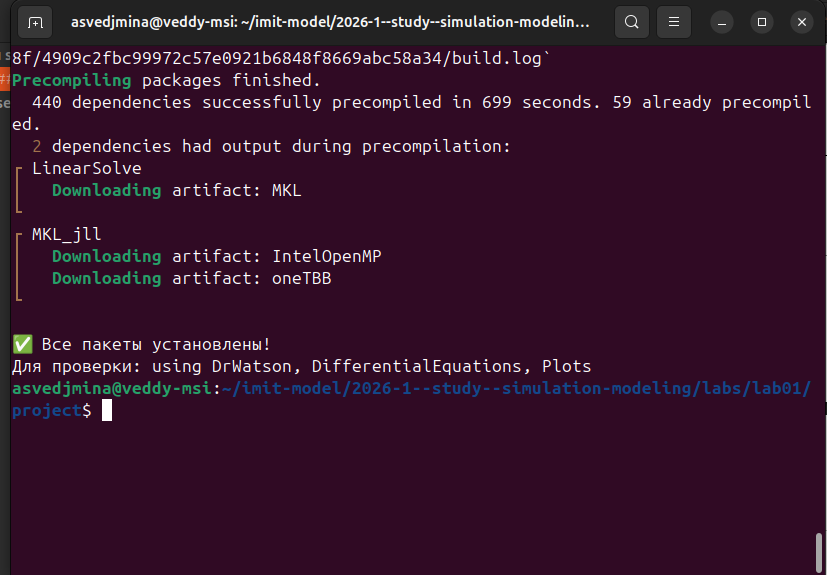{#fig-009 width=70%}

Проверим работоспособность проекта с помощью скрипта test_setup.jl.

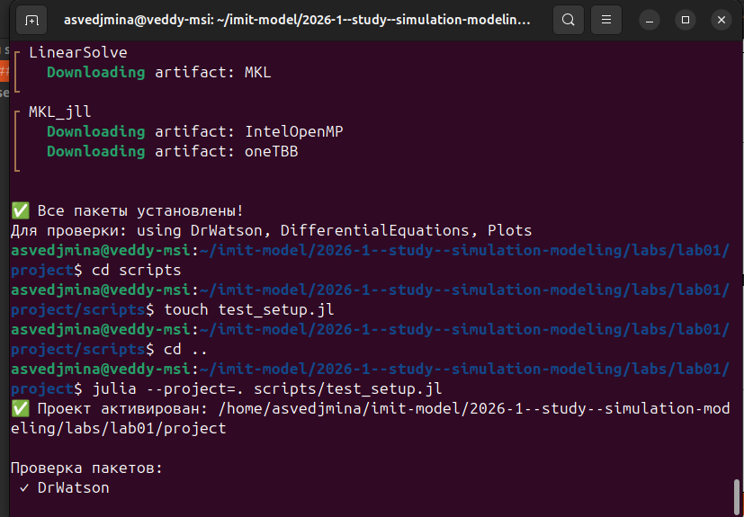{#fig-010 width=70%}

## 3. Базовая модель экспоненциального роста

Запустим скрипт 01_exponential_growth.jl, который решает ОДУ экспоненциального роста при $\alpha = 0.3$. Получим результирующий график и таблицу данных.

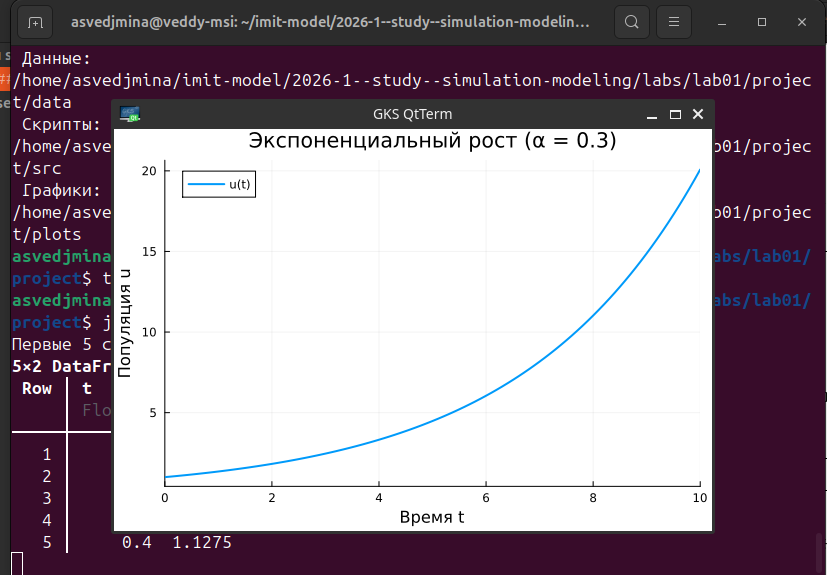{#fig-011 width=70%}

Рассмотрим график подробнее. На графике видна характерная экспоненциальная кривая с начальным значением $u_0 = 1.0$ и временем моделирования $t \in [0, 10]$.

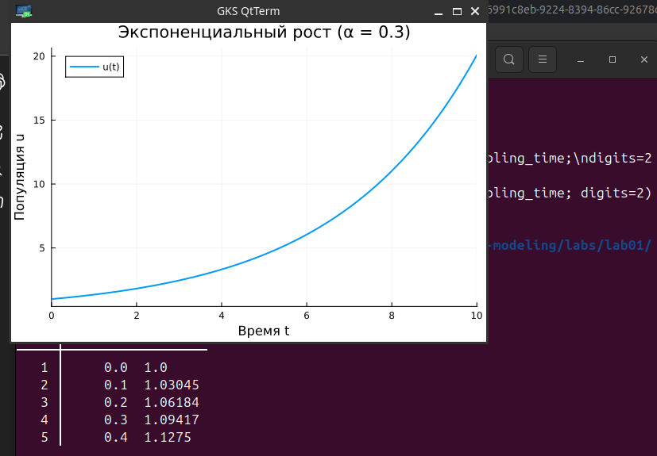{#fig-012 width=70%}

Результат выполнения скрипта: таблица первых 5 строк DataFrame с численным решением и аналитическое время удвоения $T_2 = 2.31$.

{#fig-013 width=70%}

## 4. Создание производных форматов

Запустим скрипт tangle.jl для генерации производных форматов из литературного кода: чистый Julia-скрипт, Jupyter notebook и документация в формате Quarto.

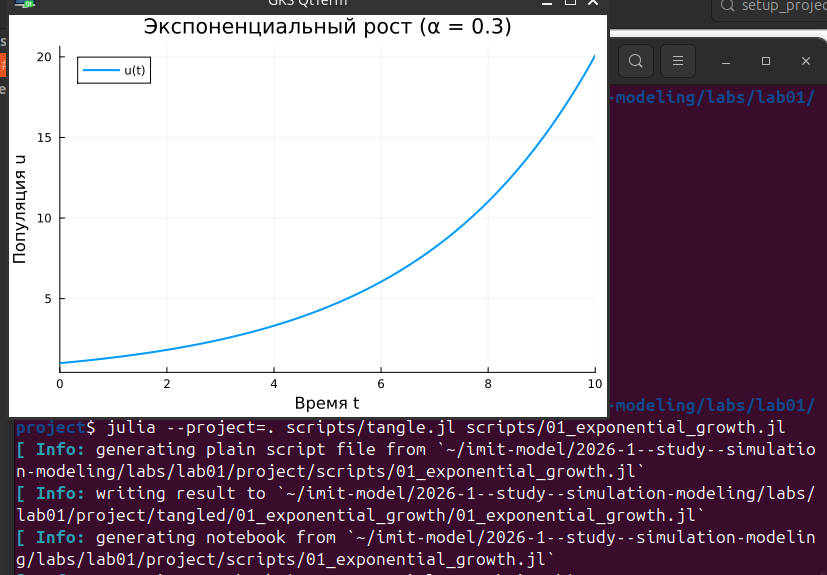{#fig-014 width=70%}

Скрипт tangle.jl генерирует все три формата для обоих экспериментов.

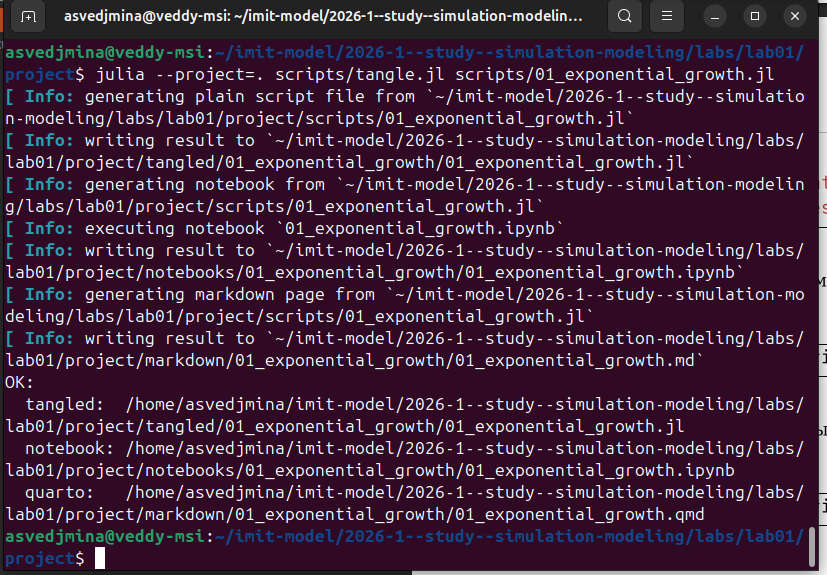{#fig-015 width=70%}

## 5. Параметрическое исследование экспоненциального роста

Запустим скрипт 02_exponential_growth.jl, который выполняет параметрическое сканирование по $\alpha \in \{0.1, 0.3, 0.5, 0.8, 1.0\}$. На графике виден базовый эксперимент при $\alpha = 0.3$.

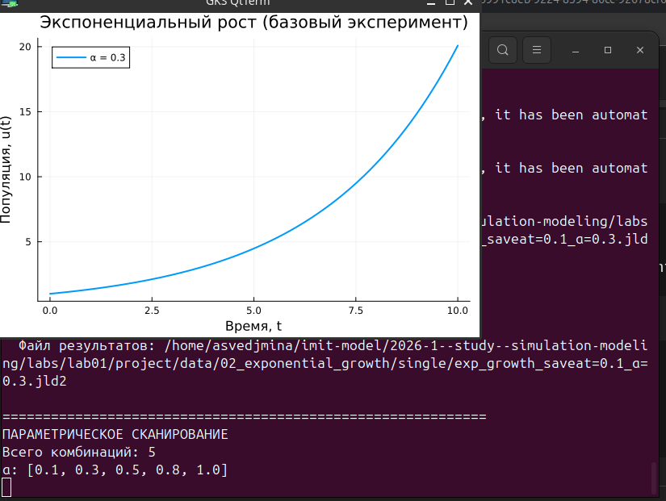{#fig-016 width=70%}

Результаты параметрического сканирования: таблица зависимости финальной популяции и времени удвоения от параметра $\alpha$, а также результаты бенчмаркинга.

{#fig-017 width=70%}

Итоговый график параметрического исследования, демонстрирующий влияние скорости роста $\alpha$ на динамику популяции.

{#fig-018 width=70%}

# Выводы

В ходе выполнения лабораторной работы была настроена рабочая среда для курса математического моделирования: установлены git-flow, Julia 1.12.4, создан проект DrWatson с необходимыми пакетами. Реализована численная модель экспоненциального роста с использованием DifferentialEquations.jl. Проведён базовый вычислительный эксперимент при $\alpha = 0.3$ и параметрическое сканирование по набору значений $\alpha$. Код преобразован в литературный стиль с генерацией производных форматов (Julia-скрипт, Jupyter notebook, Quarto-документация). Результаты подтверждают корректность численного решения и демонстрируют экспоненциальный характер зависимости финальной популяции от скорости роста.

# Список литературы{.unnumbered}

::: {#refs}
:::
